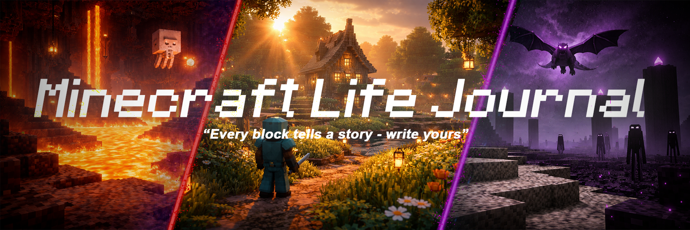

# ✨ Minecraft Life Journal ✨

 

 

**A cinematic, immersive web application for documenting your Minecraft adventures.**

[Features](#%EF%B8%8F-the-journey-begins) • [Installation](#%EF%B8%8F-forge-your-instance) • [Tech Stack](#-architectural-blueprints) • [Contributing](#-join-the-guild)

---

## 🗺️ The Journey Begins

Minecraft Life Journal isn't just a tracking tool; it's a cinematic vault for your greatest blocky achievements. Built with an uncompromising focus on aesthetics, it features breathing animated backgrounds, glass-morphism UI elements, and a tailored dark mode to make your memories shine.

 

<table>
  <tr>
    <td width="50%" valign="top">
      <h3>📸 Memories That Last</h3>
      
Log your greatest builds, most hilarious deaths, and proudest achievements with rich descriptions, categories, and high-quality image uploads.

    </td>
    <td width="50%" valign="top">
      <h3>🌍 Your Worlds, Your Rules</h3>
      
Seamlessly create and manage multiple Minecraft worlds, tracking their seed, version, mode, and the memories forged within them.

    </td>
  </tr>
  <tr>
    <td width="50%" valign="top">
      <h3>🧭 Never Lose Your Way</h3>
      
Our built-in Coordinate Tracker ensures you never lose that perfect village or ancient city again. Save X, Y, Z coordinates with custom labels.

    </td>
    <td width="50%" valign="top">
      <h3>🎬 Cinematic Experience</h3>
      
Relive your adventures in a stunning, fullscreen Ken Burns slideshow mode that turns your screenshots into a breathing narrative.

    </td>
  </tr>
    <tr>
    <td width="50%" valign="top">
      <h3>🤝 Share The Legacy</h3>
      
Generate secure, view-only links to broadcast your worlds and memories to friends or the wider community.

    </td>
    <td width="50%" valign="top">
      <h3>👤 Personalize Your Profile</h3>
      
Establish your identity with customizable profiles, avatars, bios, and experience levels.

    </td>
  </tr>
</table>

---

## 🛠️ Forge Your Instance

Ready to host your own journal or contribute to the adventure? 

All installation instructions, environment variables setup, and deployment guides can be found in our comprehensive **[Developer Documentation](./DEVELOPERS.md)**.

---

## 🧱 Architectural Blueprints

Curious about the redstone behind the scenes? 

The Minecraft Life Journal is built with a modern stack including **Next.js 16+**, **MongoDB**, **Tailwind CSS**, and **Framer Motion**. 

For a deep dive into our Project Structure, API Endpoints, Security Measures, and Design Philosophy, please consult the **[Developer Documentation](./DEVELOPERS.md)**.

---

## 🤝 Join The Guild

We welcome builders and developers of all skill levels! If you're interested in improving the journal, please read our [CONTRIBUTING.md](./CONTRIBUTING.md) for guidelines on how to submit pull requests, report bugs, and suggest features.

---

   
  <b>✨🎮 Happy Minecrafting! 🎮✨</b>
    
  Developed by <b>@SamXop123</b>

